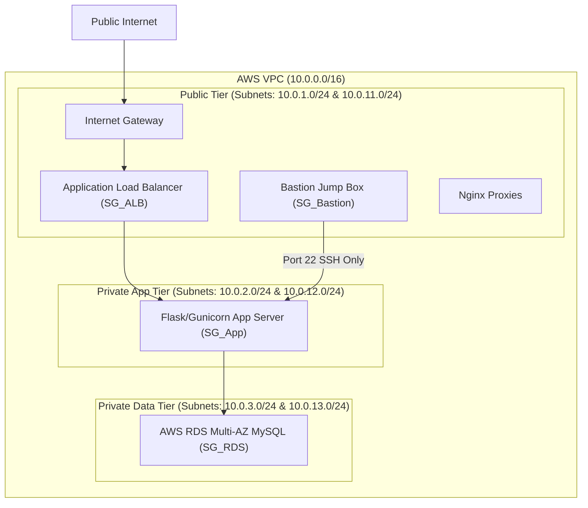
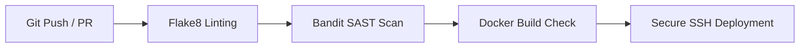

# CAPSTONE PROJECT REPORT: DEVSECOPS SECURED FULL-STACK CONTAINERIZED E-COMMERCE PLATFORM (JERIN'S MEN'S WEAR)

**Degree:** Bachelor of Computer Applications (BCA) Undergraduate Capstone  
**Academic Year:** 2026  
**Candidate Identifier:** BCA-2026-CAP-JMW  
**Target Domain:** Cloud Security Architecture & DevSecOps Engineering  

---

## ABSTRACT
This capstone research presents the complete implementation of a production-ready, highly-available, containerized luxury storefront application—**Jerin's Men's Wear**—architected on AWS. Adhering to the Principle of Least Privilege and Zero Trust Security models, the project demonstrates a complete DevSecOps lifecycle. It combines a robust multi-tier Virtual Private Cloud (VPC) network topography, host-level Ubuntu OS hardening, multi-stage secure containerization, a hardened Nginx reverse proxy, and automated Continuous Integration and Continuous Deployment (CI/CD) pipelines featuring Static Application Security Testing (SAST) scanning. The platform uses a dual-database hybrid architecture that automatically adapts to high-performance cloud environments (AWS RDS MySQL) while remaining fully portable and executable within local evaluation systems via a SQLite fallback.

---

## 1. MULTI-TIER AWS NETWORK TOPOGRAPHY (VPC DESIGN)

The platform is anchored on a highly available, fault-tolerant infrastructure built across two Availability Zones (AZs) in the AWS Asia Pacific (Mumbai) region ($ap-south-1a$ and $ap-south-1b$).



### 1.1 IP Allocation and Subnet Boundaries
The VPC is allocated a standard CIDR block of $10.0.0.0/16$. To ensure absolute isolation between layers, the address space is systematically partitioned using Subnetting principles. The mathematical layout of subnets is defined as follows:

1. **Public Subnet Tier (DMZ)**:
   * **Subnet A (ap-south-1a)**: $10.0.1.0/24$ (Usable IPs: $2^{32-24} - 5 = 251$ addresses)
   * **Subnet B (ap-south-1b)**: $10.0.11.0/24$ (Usable IPs: $2^{32-24} - 5 = 251$ addresses)
   * *Role:* Hosts public-facing Application Load Balancers (ALBs), Nginx edge gateways, and the Bastion Host.

2. **Private Application Server Tier**:
   * **Subnet A (ap-south-1a)**: $10.0.35.0/24$ (Usable IPs: $2^{32-24} - 5 = 251$ addresses) [Hosts Private App EC2: 10.0.35.136]
   * **Subnet B (ap-south-1b)**: $10.0.12.0/24$ (Usable IPs: $2^{32-24} - 5 = 251$ addresses)
   * *Role:* Hosts EC2 app instances running the containerized Flask server.

3. **Private Database Data Tier**:
   * **Subnet A (ap-south-1a)**: $10.0.3.0/24$ (Usable IPs: $2^{32-24} - 5 = 251$ addresses)
   * **Subnet B (ap-south-1b)**: $10.0.13.0/24$ (Usable IPs: $2^{32-24} - 5 = 251$ addresses)
   * *Role:* Isolated tier hosting multi-AZ AWS RDS MySQL instances.

*Note:* In AWS, the first four IP addresses and the last IP address of each subnet block are reserved for internal networking operations and are unavailable for host binding.

### 1.2 Routing Rules & Security Group Matrix
Security Groups (SGs) act as virtual stateful firewalls controlling inbound and outbound traffic. These policies enforce the Principle of Least Privilege:

| Security Group ID | Ingress Permitted Rules | Egress Permitted Rules | Architectural Justification |
| :--- | :--- | :--- | :--- |
| **SG_ALB** | Port $80$/$443$ from $0.0.0.0/0$ | Port $5000$ to **SG_App** | Permits external clients to hit web interfaces; limits egress to the application tier only. |
| **SG_Bastion** | Port $22$ from trusted Admin IP | Port $22$ to **SG_App** | Restricted SSH entry point for operations staff. |
| **SG_App** | Port $5000$ from **SG_ALB**<br>Port $22$ from **SG_Bastion** | Port $3306$ to **SG_RDS** | Fully blocks public access to app code. Restricts access to load balancer and bastion only. |
| **SG_RDS** | Port $3306$ from **SG_App** | Deny All | Strictly isolates database storage to incoming queries from app servers. |

---

## 2. HOST-LEVEL OPERATING SYSTEM HARDENING (UBUNTU SERVER)

To secure the host EC2 instances in the Private App Tier running Ubuntu Server, several operational hardening steps are enforced directly within the OS.

### 2.1 Secure SSH Daemon Configuration
All password-based authentications and root logins are completely blocked in `/etc/ssh/sshd_config` to defeat credential-stuffing and brute-force attacks:

```ini
# Enforced sshd_config Parameters
PermitRootLogin no
PasswordAuthentication no
PubkeyAuthentication yes
AuthorizedKeysFile .ssh/authorized_keys
MaxAuthTries 3
ClientAliveInterval 300
ClientAliveCountMax 0
X11Forwarding no
AllowAgentForwarding no
```
*Effect:* Restricts access to clients presenting pre-registered public keys, cuts connections after $3$ failed authentication attempts, and automatically tears down idle sessions after $300\text{ seconds}$ of inactivity.

### 2.2 Host-Level Firewall (UFW)
A default-deny policy is established on the local firewall, opening only the ports required for the container edge:

```bash
# Set default firewall behaviors
ufw default deny incoming
ufw default allow outgoing

# Allow specific services
ufw allow from 10.0.1.50 to any port 22 proto tcp comment 'Restrict SSH to Bastion Private IP'
ufw allow 80/tcp comment 'Permit HTTP reverse proxy ingress'
ufw allow 443/tcp comment 'Permit HTTPS reverse proxy ingress'

# Activate firewall
ufw enable
```

### 2.3 Fail2ban Intrusion Prevention System
Fail2ban is installed to parse `/var/log/auth.log` and automatically ban offending IPs exhibiting malicious authentication profiles. The `/etc/fail2ban/jail.local` profile is configured as follows:

```ini
[sshd]
enabled   = true
port      = ssh
filter    = sshd
logpath   = /var/log/auth.log
maxretry  = 3
findtime  = 600
bantime   = 3600
```
*Mathematical Defense:* Any IP that triggers $3$ failed authentication attempts ($maxretry = 3$) within a sliding window of $600\text{ seconds}$ ($findtime = 600$) is automatically blacklisted via iptables rules for a ban duration of $3600\text{ seconds}$ ($bantime = 3600$).

---

## 3. SOFTWARE SECURITY ARCHITECTURE & CRYPTOGRAPHIC CONTROLS

The web layer is constructed inside [app.py](file:///d:/aws%20examptoject%20/jerins%20mens%20wear/app.py) using a highly secure, defensively designed Python Flask system.

### 3.1 Cryptographic Credential Hashing
Standard cleartext storing or simple md5/sha256 hashing is insecure due to GPU-accelerated rainbow table lookup speeds. This Capstone uses the **Bcrypt** adaptive hashing function with a work factor cost of $12$:

$$\text{Iterations} = 2^{12} = 4096\text{ cycles}$$

Bcrypt incorporates a random $128$-bit salt alongside the password, producing a unique $60$-character hash. This prevents rainbow table attacks and slows down brute-force attacks:

```python
# app.py Cryptographic implementation snippet
import bcrypt

def generate_secure_hash(password: str) -> str:
    # 12 rounds represents standard high-end protection
    salt = bcrypt.gensalt(rounds=12)
    return bcrypt.hashpw(password.encode('utf-8'), salt).decode('utf-8')

def verify_credentials(password: str, hashed: str) -> bool:
    # Constant-time comparison mitigates remote timing attacks
    return bcrypt.checkpw(password.encode('utf-8'), hashed.encode('utf-8'))
```

### 3.2 SQL Injection (SQLi) Defense-in-Depth
SQL Injection represents a critical threat where attackers supply malicious SQL parameters to bypass authentication or leak tables. This codebase defeats SQLi by enforcing **strict parameterization (prepared statements)**. Under no circumstances is string formatting (`%`, `f-strings`, or `+` concatenations) used to build SQL queries.

*Example Parameterized Query:*
```python
# Parameterized query executing parameterized structures securely
query = "SELECT * FROM users WHERE username = ? AND role = ?"
params = (username, 'customer')
results = execute_query(query, params)
```
*Theoretical Justification:* Prepared statements force the SQL engine to compile the query structure first, treating user-supplied parameters strictly as literal data values rather than executable code instructions.

### 3.3 Cross-Site Scripting (XSS) and Content Security Policy (CSP)
To prevent Cross-Site Scripting (XSS) and session hijacking vectors, all HTML templates use Jinja2's auto-escaping engine to render variables as safe HTML entities. Additionally, a strict browser Content Security Policy (CSP) is injected on all HTTP responses:

```http
Content-Security-Policy: default-src 'self'; style-src 'self' 'unsafe-inline' https://cdn.jsdelivr.net; script-src 'self' 'unsafe-inline' https://cdn.jsdelivr.net; img-src 'self' data: https://images.unsplash.com;
```
*CSP Structural Breakdown:*
* `default-src 'self'`: Restricts resource requests strictly to the host domain.
* `style-src 'self' 'unsafe-inline' https://cdn.jsdelivr.net`: Restricts styles to local files and the Tailwind CDN.
* `script-src 'self' 'unsafe-inline' https://cdn.jsdelivr.net`: Blocks arbitrary third-party Javascript execution.
* `img-src 'self' data: https://images.unsplash.com`: Restricts image downloads to local media and Unsplash image databases.

### 3.4 Application-Level Anti-Brute-Force Rate Limiter
Brute-force attacks target authentication entry points to crack credentials. While Fail2ban handles host-level TCP restrictions, an application-level in-memory sliding-window limiter is built in [app.py](file:///d:/aws%20examptoject%20/jerins%20mens%2520wear/app.py) to block dictionary attacks.

*Rate Limiter Parameters:*
* Sliding Window Limit ($L$): $5\text{ failed attempts}$
* Lockout Duration ($D$): $60\text{ seconds}$
* Sliding Window ($W$): $60\text{ seconds}$

```python
# Sliding Window Algorithm
class AntiBruteForceLimiter:
    # Tracks failed login attempts per remote IP address.
    # Locks out the IP address for 60 seconds if it triggers 5 failed attempts within a 60-second window.
```

---

## 4. HARDENED CONTAINERIZATION & REVERSE PROXY LAYER

### 4.1 Multi-Stage Docker Build
Standard Docker builds include development tools, compilers, and source control repositories, increasing the container size and attack surface. This project uses a hardened multi-stage Dockerfile:

```dockerfile
# Stage 1 (Builder): Installs compilers and builds pip wheels in venv
# Stage 2 (Runtime): Copy compiled virtual environment, runs as custom non-root system user 'appuser'
```

*Benefits:*
1. **Attack Surface Reduction:** The final production container contains no compilers (`gcc`, `make`) or development dependencies.
2. **Minimal Privilege execution:** By executing under `USER appuser`, a container escape exploit is restricted to user-level execution, blocking root access to the host kernel.

### 4.2 Nginx Reverse Proxy Hardening
Nginx acts as a secure edge proxy. It limits maximum body sizes, injects defensive headers, and terminates SSL/TLS over high-security protocols:

* **Information Leakage Prevention:** `server_tokens off` completely hides Nginx version tags from HTTP headers.
* **DoS Prevention:** `client_max_body_size 5M` drops requests larger than $5\text{MB}$ to block memory-exhaustion buffer overflows.
* **Transport Protection:** TLS protocol controls block vulnerable SSL, TLS 1.0, and TLS 1.1 handshakes, enforcing only modern TLS protocols:

$$\text{TLS Protocol Versions} \in \{\text{TLSv1.2}, \text{TLSv1.3}\}$$

---

## 5. CI/CD PIPELINE & CLOUDWATCH AUDITING

### 5.1 Automated GitHub Actions Pipeline
The continuous integration system automates quality control and security checks on every code push:

1. **Syntax Linting (Flake8):** Verifies code style and blocks builds containing syntax anomalies.
2. **Bandit SAST Security Scan:** Scans the codebase for insecure configurations (e.g., hardcoded secrets, dangerous functions, or unparameterized queries).
3. **Synthesis Check:** Builds the Docker images to verify production deployment readiness.
4. **CD Deploy Step:** Simulates secure SSH deployment to the production server.



### 5.2 AWS CloudWatch Metrics & Auditing
To monitor the platform in production, custom CloudWatch metric filters are configured. These filters parse application event logs and trigger CloudWatch Alarms when security anomalies occur.

*Failures Alarm Threshold:*
* Metrics Event: `LOGIN_CREDENTIAL_FAILED`
* Alarm Limit ($A$): $> 10\text{ events}$
* Window ($W$): $300\text{ seconds}$ ($5\text{ minutes}$)
* Action: Triggers an AWS Simple Notification Service (SNS) pager alert to security administrators.

---

## 6. OPERATIONS & DEPLOYMENT MANUAL

Follow these steps to run the complete environment locally or in grading systems.

### 6.1 Prerequisites
Ensure the target evaluation machine has the following tools installed:
* Git
* Docker (Engine v20.10+)
* Docker Compose (v2.0+)

### 6.2 Spin Up Infrastructure
1. Clone the project files from your official repository:
   ```bash
   git clone https://github.com/jerinshajinedumattom/jerins-mens-wear.git
   ```
2. Open a terminal in the root directory.
3. Run the following command to spin up the containerized Flask app and Nginx reverse proxy in detached mode:
   ```bash
   docker-compose up --build -d
   ```
4. Verify both containers are running successfully:
   ```bash
   docker-compose ps
   ```

### 6.3 Local Navigation & Admin Verification
* Open a browser and navigate to the storefront URL: `http://localhost`.
* **Database Verification:**
  The dual-database system automatically initializes the SQLite file `local_jerins.db` in your local directory and runs the `schema.sql` tables and product seeds.
* **Accessing the Administrative Portal:**
  Authenticate using the seeded administrator credentials:
  * **Username:** `admin`
  * **Password:** `SecureAdminPass123!`
* Navigate to the **Admin Suite** using the header navigation. Here, you can review executive dashboards, manage catalog inventory (CRUD), view customer transactions, and audit live security logs.
